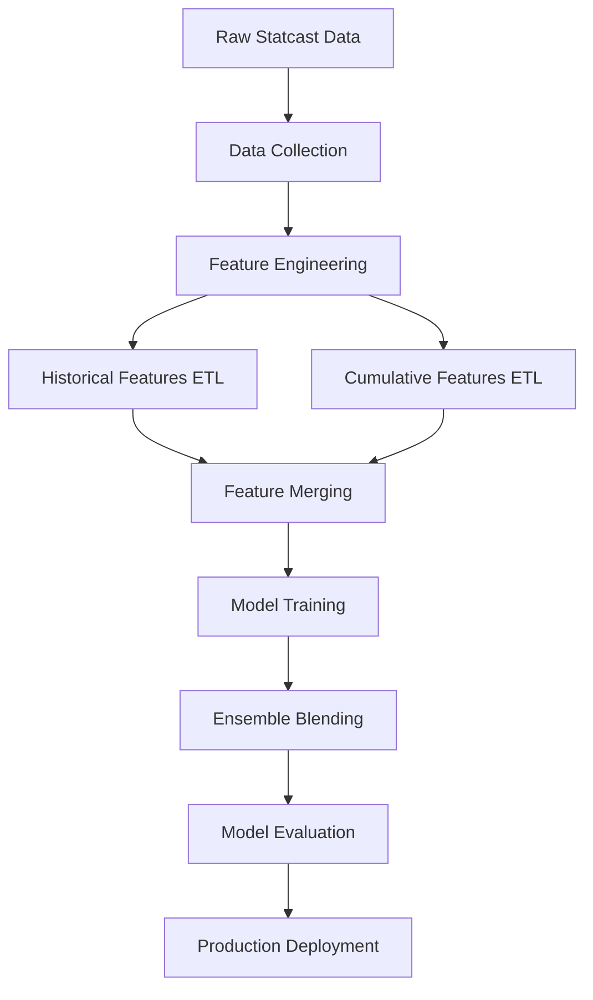

# MLB Pitch Prediction Pipeline

A comprehensive machine learning pipeline for predicting MLB pitch types and outcomes using Statcast data.

## 🎯 Architecture Overview

### Complete Hierarchical Multi-Model Architecture with Outcome Prediction

We use a five-tier hierarchical model system: **Family → Pitch Type → Outcome Prediction**

**Family Head Model: Strategic Pitch Family Classification**
- **Task**: Predict pitch family approach (3 classes: FB=Fastball, BR=Breaking, OS=Off-speed)  
- **Features**: 94 strategic features (situational + historical performance)
- **Output**: Family probabilities used as features for pitch type models
- **Expected Accuracy**: 60-65% (strategic approach prediction)

**GRU Head Model: Neural Sequence Modeling**
- **Task**: Learn pitch sequencing patterns using recent pitch history
- **Architecture**: Embedding + GRU(64) + FC(9) - PyTorch neural network
- **Features**: Last 5 pitch types + balls/strikes/velocity change
- **Output**: 9-class pitch type logits (excludes OTHER class)
- **Expected Accuracy**: 50-60% (complements tree models with sequence patterns)

**Tree Ensemble: Strategic Pattern Learning**
- **Task**: Predict specific pitch type using traditional ML features
- **Models**: LightGBM + XGBoost + CatBoost ensemble
- **Features**: 97 strategic features including family probabilities
- **Output**: 10-class pitch type probabilities
- **Expected Accuracy**: 55-65% (realistic for pitch prediction)

**Ensemble Integration: Tree-GRU Blending**
- **Method**: Weighted ensemble of tree predictions and GRU logits
- **Optimization**: Grid search for optimal blend weights (typically Tree=0.8, GRU=0.2)
- **Benefits**: Combines strategic understanding (trees) with sequence modeling (GRU)

**Two-Stage Outcome Prediction: Complete Pipeline**
- **Stage 1**: 3-class outcome prediction (IN_PLAY / BALL / STRIKE)
- **Stage 2**: 7-class Ball-in-Play prediction (HR, 3B, 2B, 1B, FC, SAC, OUT)
- **Features**: Blended pitch type logits from Tree-GRU ensemble
- **Architecture**: LightGBM models trained on pitch prediction outputs
- **Expected Performance**: Stage 1 AUC ~0.58, BIP Top-3 Accuracy ~91-100%

### 🛡️ Anti-Leakage Measures

1. **Temporal Separation**: 
   - Train on 2023 data (April-September)
   - Validate on 2024 data (April only) 
   - Test on 2025 data (April-June, excluding March)

2. **Explicit Feature Filtering**:
   - **Keeps ONLY 94 manually vetted safe features** from 129 total columns
   - **Blocks ALL current-pitch physics**: `release_speed`, `pfx_x`, `plate_x`, `zone`, etc.
   - **Blocks ALL outcome information**: `events`, `description`, `estimated_woba`, etc.
   - **No pattern matching**: Explicit whitelist prevents false positives

3. **Fixed Pitch Type Mapping**:
   - Added ST (Sweeper) as separate category (~8% of modern pitches)
   - Proper canonicalization: SV→SL, FA→FF, CS→CU
   - Reduced OTHER category from 7.6% to 0.3%

## 🚀 Quick Start

### 1. Build Historical Features

First, rebuild features with fixed pitch type mapping:

```bash
# Rebuild 2025 features with fixed ST mapping
python etl/build_historical_features.py 2025

# Build 2023-2024 if needed for training
python etl/build_historical_features.py 2023
python etl/build_historical_features.py 2024
```

### 2. Train Family Head Model (Optional)

The family head model provides strategic-level features for the main pipeline:

```bash
# Train family head model (auto-runs if needed)
python scripts/train_family_head.py --train-years 2023 --toy

# Or train on multiple years for production
python scripts/train_family_head.py --train-years 2019 2020 2021 2022 2023
```

### 3. Train GRU Head Model (Optional - Sequence Modeling)

The GRU head model provides neural sequence modeling to complement tree-based models:

```bash
# Train GRU model (requires PyTorch)
python scripts/train_gru_head.py --train-years 2023 --val-range 2024-04-01:2024-04-15

# GPU training (if available)
GPU=1 python scripts/train_gru_head.py --train-years 2023 --val-range 2024-04-01:2024-04-15

# Production training with more epochs
python scripts/train_gru_head.py --train-years 2019 2020 2021 2022 2023 --val-range 2024-04-01:2024-07-31 --epochs 5
```

**GRU Architecture Details:**
- **Input**: Last 5 pitch types (embedded) + balls/strikes/velocity change
- **Model**: Embedding(10→16) → GRU(83→64) → FC(64→9) → Dropout(0.2)
- **Output**: Saves `models/gru_head.pt`, `models/gru_logits_val.npy`, `models/gru_logits_test.npy`
- **Integration**: Automatically detected and blended by main pipeline

### 4. Train Outcome Head Models (Complete Pipeline)

Train two-stage outcome prediction models that use blended pitch type logits as features:

```bash
# Train outcome heads (requires trained tree models first)
python scripts/train_outcome_heads.py --train-years 2023 --val-range 2024-04-01:2024-04-15

# Production training with multiple years
python scripts/train_outcome_heads.py --train-years 2019 2020 2021 2022 2023 --val-range 2024-04-01:2024-07-31
```

**Two-Stage Architecture:**
- **Stage 1**: 3-class prediction (IN_PLAY / BALL / STRIKE)
- **Stage 2**: 7-class Ball-in-Play outcomes (HR, 3B, 2B, 1B, FC, SAC, OUT)
- **Input Features**: Blended pitch type logits from Tree-GRU ensemble
- **Output**: `models/stage_heads/{stage1.lgb, bip.lgb}` + encoders

**Outcome Prediction Integration:**
- Automatically loaded and evaluated during main pipeline testing
- Provides comprehensive outcome metrics alongside pitch type prediction
- Uses same temporal separation as pitch type models

### 5. Hyperparameter Optimization (Recommended)

Use Optuna to automatically optimize LightGBM hyperparameters for better performance:

```bash
# Quick optimization (3-5 trials for testing)
python run_full_pipeline.py optuna --train-years 2023 --val 2024-04-01:2024-04-15 --trials 5 --toy

# Production optimization (20+ trials for best results)
python run_full_pipeline.py optuna --train-years 2019 2020 2021 2022 2023 --val 2024-04-01:2024-07-31 --trials 50

# Or run directly
python scripts/optuna_lgb.py --train-years 2023 --val-range 2024-04-01:2024-04-15 --trials 20
```

**Optuna Search Space:**
- `num_leaves`: [64, 128, 192, 256]
- `min_data_in_leaf`: [20, 50, 100]
- `feature_fraction`: [0.6, 0.7, 0.8, 0.9]
- `lambda_l1`: [0, 0.1, 0.5] (L1 regularization)
- `lambda_l2`: [0, 0.1, 0.5] (L2 regularization)

### 6. Run Quick Test (2023-2025 data)

Test the hierarchical model approach using the current available data:

```bash
# Quick test with 2023-2025 data (includes family probabilities + Optuna optimization + GRU ensemble)
python two_model_architecture.py

# Or use the main pipeline (will auto-use Optuna params + GRU logits if available)
python run_full_pipeline.py train --train-years 2023 --train-range 2023-04-01:2023-09-30 --val 2024-04-01:2024-04-15 --test 2024-04-16:2024-04-30 --toy
```

This will auto-detect available years and use:
- Train: 2023 data (80%)
- Val: 2023 data (20% - temporal split)
- Test: 2025 data

**Automatic Integration:**
- Family head model will be automatically trained if not present
- **Optuna-optimized parameters** will be used if available
- **GRU logits** will be automatically blended if present (typically Tree=0.8, GRU=0.2)

### 7. Build More Historical Data

Build additional years for the full training run:

```bash
# Build historical features for earlier years
python etl/build_historical_features.py 2018
python etl/build_historical_features.py 2019
python etl/build_historical_features.py 2020
python etl/build_historical_features.py 2021
python etl/build_historical_features.py 2022
python etl/build_historical_features.py 2024
```

### 8. Full Training Pipeline (2018-2025 data)

After building all historical data:

```bash
# Full training - automatically uses all available years
python two_model_architecture.py
```

This will auto-detect all available years and use:
- Train: 2018-2023 data
- Val: 2024 data
- Test: 2025 data

## 📊 Expected Results

### Realistic Performance Ranges

#### Pitch Type Prediction
- **Tree Ensemble Accuracy**: 45-50% (baseline performance)
- **Tree-GRU Ensemble Accuracy**: 47-52% (improved with sequence modeling)
- **Log-Loss**: 1.20-1.40 (lower is better)

#### Outcome Prediction
- **Stage 1 AUC (IN_PLAY detection)**: 0.55-0.65
- **BIP Top-3 Accuracy**: 85-100% (predicting correct BIP outcome in top 3 predictions)
- **Mean Expected Run Value**: 0.10-0.15 per pitch

### Complete Pipeline Example Output
```
🎯 FINAL TEST RESULTS
   Accuracy: 47.38% (pitch type prediction)
   Log-Loss: 1.3578
   Ensemble: Tree + GRU

🎯 OUTCOME PREDICTION RESULTS
   Stage 1 AUC (IN_PLAY detection): 0.5861
   BIP Top-3 Accuracy: 100% (38/38)  
   Mean Expected Run Value: 0.1108
```

### Why These Numbers Are Realistic
- Pitch selection involves many unobservable factors (catcher signals, pitcher preference, game plan)
- Even MLB scouts and analysts struggle to predict pitches with high accuracy
- Our features capture strategic tendencies, not deterministic rules
- **WARNING**: If seeing >75% pitch accuracy or >80% outcome accuracy, check for data leakage!

## 🏗️ Data Pipeline

### Feature Engineering

**97 Strategic Features** (Explicit Whitelist):
- **Core Context** (11): Count, score, baserunners, handedness
- **Arsenal Features** (30): 30-day usage/velocity/spin by pitch type (10 types × 3 metrics)
- **Batter Matchups** (10): Historical xwOBA vs each pitch type (30-day)
- **Count Performance** (6): Contact/whiff rates in AHEAD/BEHIND/EVEN counts
- **Whiff Rates by Pitch** (10): 30-day whiff rates for each pitch type
- **Performance vs Handedness** (6): Hit/whiff/xwOBA rates vs L/R batters
- **Recent Form** (3): 7-day rolling performance trends
- **Sequence** (5): Previous pitch types and velocity change
- **Cumulative** (10): Within-game pitch counts and patterns
- **Player IDs** (2): Batter/pitcher FanGraphs identifiers
- **Overall Rates** (1): General strikeout rate
- **Family Probabilities** (3): Strategic pitch family approach (FB/BR/OS)

**Explicit Safe Feature List** (72.9% of original 129 columns):
```python
KEEP_FEATURES = {
    # Core situational (11)
    'balls', 'strikes', 'outs_when_up', 'on_1b', 'on_2b', 'on_3b',
    'home_score', 'away_score', 'stand', 'p_throws', 'count_state',
    
    # Arsenal features (30) - 10 pitch types × 3 metrics
    'velocity_30d_*', 'spin_rate_30d_*', 'usage_30d_*',
    
    # Batter matchups (10)
    'batter_xwoba_30d_*',
    
    # Count performance (6)
    'contact_rate_30d_AHEAD/BEHIND/EVEN', 'whiff_rate_30d_AHEAD/BEHIND/EVEN',
    
    # Whiff rates by pitch (10)
    'whiff_rate_30d_CH/CU/FC/FF/FS/KC/OTHER/SI/SL/ST',
    
    # Performance vs handedness (6)
    'hit_rate_30d_vs_L/R', 'whiff_rate_30d_vs_L/R', 'xwoba_30d_vs_L/R',
    
    # Recent form (3)
    'hit_rate_7d', 'velocity_7d', 'whiff_rate_7d',
    
    # Sequence/lags (5)
    'prev_pitch_1', 'prev_pitch_2', 'prev_pitch_3', 'prev_pitch_4', 'dvelo1',
    
    # Cumulative within-game (10)
    'cum_*_count/spin/velocity', 'cum_game_pitches',
    
    # Player identifiers (2)
    'batter_fg', 'pitcher_fg',
    
    # Overall rates (1)
    'k_rate_30d',
    
    # Family probabilities (3)
    'FAM_PROB_FB', 'FAM_PROB_BR', 'FAM_PROB_OS',
}
```

**Key Exclusions** (35 blocked features):
- **Current pitch physics**: `release_speed`, `pfx_x/z`, `plate_x/z`, `zone`, `vx0/vy0/vz0`
- **Outcome information**: `events`, `description`, `estimated_woba_using_speedangle`, `delta_run_exp`
- **Launch data**: `launch_speed`, `launch_angle`, `hit_distance_sc`
- **Identifiers**: `game_pk`, `at_bat_number`, `pitcher`, `batter`, `home_team`
- **Physics vectors**: `ax`, `ay`, `az`, `effective_speed`, `sz_top/bot`

### Temporal Windows

All historical features use proper temporal separation:
- **30-day windows**: `RANGE BETWEEN INTERVAL 29 DAY PRECEDING AND INTERVAL 1 DAY PRECEDING`
- **7-day windows**: `RANGE BETWEEN INTERVAL 6 DAY PRECEDING AND INTERVAL 1 DAY PRECEDING`
- **NO same-day data**: Prevents temporal leakage

## 🔧 Configuration

### Model Parameters

**LightGBM Settings**:
- Multi-class classification
- Early stopping (100 rounds)
- Learning rate: 0.1
- Num leaves: 31
- Feature/bagging fraction: 0.8

### Data Splits

**Temporal Separation**:
- Different years for train/validation/test
- No overlapping date ranges
- Sufficient time gaps to prevent information leakage

## 🎯 Key Features

### Family Head Model Architecture

**Strategic Innovation**: Before predicting specific pitch types, we first predict the strategic pitch family approach:

#### 🎯 Pitch Family Mapping
- **FB (Fastball Family)**: FF (Four-seam), SI (Sinker), FC (Cutter)
- **BR (Breaking Ball Family)**: SL (Slider), CU (Curveball), KC (Knuckle Curve), OTHER
- **OS (Off-Speed Family)**: CH (Changeup), FS (Splitter), ST (Sweeper)

#### 📊 Family Model Benefits
- **Strategic Context**: Captures high-level pitch approach decisions
- **Feature Engineering**: Family probabilities become features for main model
- **Hierarchical Learning**: Decomposes complex 10-class problem into 3+10 class structure
- **Interpretability**: Shows pitcher's strategic tendencies vs tactical execution

#### 🚀 Auto-Training Integration
```bash
# Family model auto-trains if not present
python run_full_pipeline.py train --train-years 2023 --toy

# Or train explicitly
python scripts/train_family_head.py --train-years 2023 --toy
```

### Explicit 97-Feature Architecture

Our explicit whitelist approach uses **exactly 97 manually vetted features** (94 base + 3 family probabilities) to eliminate data leakage:

#### ✅ Core Situational Features (11)
- `balls`, `strikes`, `outs_when_up`: Game state
- `on_1b`, `on_2b`, `on_3b`: Baserunner context  
- `home_score`, `away_score`: Score situation
- `stand`, `p_throws`: Handedness matchup
- `count_state`: AHEAD/BEHIND/EVEN

#### ✅ Arsenal Features (30)
**10 pitch types × 3 metrics** (30-day rolling):
- `velocity_30d_*`: Average velocity by pitch type
- `spin_rate_30d_*`: Average spin rate by pitch type  
- `usage_30d_*`: Usage percentage by pitch type

**Pitch Types**: CH, CU, FC, FF, FS, KC, OTHER, SI, SL, ST

#### ✅ Batter Matchup Features (10)
- `batter_xwoba_30d_*`: Batter's 30-day xwOBA vs each pitch type
- **Why These Matter**: Core baseball strategy - pitchers attack weaknesses

#### ✅ Count Performance (6)
- `contact_rate_30d_AHEAD/BEHIND/EVEN`: Contact rates by count state
- `whiff_rate_30d_AHEAD/BEHIND/EVEN`: Whiff rates by count state  

#### ✅ Pitch-Specific Whiff Rates (10)
- `whiff_rate_30d_*`: 30-day whiff rates for each pitch type

#### ✅ Performance vs Handedness (6)
- `hit_rate_30d_vs_L/R`: Hit rates vs left/right batters
- `whiff_rate_30d_vs_L/R`: Whiff rates vs left/right batters
- `xwoba_30d_vs_L/R`: Expected wOBA vs left/right batters

#### ✅ Recent Form (3)
- `hit_rate_7d`, `velocity_7d`, `whiff_rate_7d`: 7-day trends

#### ✅ Sequence & Lags (5)  
- `prev_pitch_1`, `prev_pitch_2`, `prev_pitch_3`, `prev_pitch_4`: Previous 4 pitch types
- `dvelo1`: Velocity change from pitch N-2 to N-1 (no leakage)

#### ✅ Cumulative Within-Game (10)
- `cum_*_count/spin/velocity`: Point-in-time game stats
- `cum_game_pitches`: Total pitches thrown this game

#### ✅ Player IDs & Rates (3)
- `batter_fg`, `pitcher_fg`: FanGraphs identifiers
- `k_rate_30d`: General strikeout rate

#### ✅ Family Probabilities (3)
**Strategic-level pitch approach features from Family Head Model**
- `FAM_PROB_FB`: Probability of fastball family approach (FF, SI, FC)
- `FAM_PROB_BR`: Probability of breaking ball family approach (SL, CU, KC, OTHER)  
- `FAM_PROB_OS`: Probability of off-speed family approach (CH, FS, ST)

**Why These Matter**: Captures strategic intent before specific pitch selection

## 📈 Model Performance

### Validation Metrics
- **Accuracy**: Primary metric for classification
- **Log-Loss**: Probability calibration quality
- **Per-Class Precision/Recall**: Identify weak pitch type predictions

### Feature Importance Analysis
- **Arsenal features**: Should be top predictors for pitch type
- **Batter matchups**: Should strongly influence pitch selection
- **Count state**: Should be critical for both models

## 🔧 Hyperparameter Optimization

### Automated Optuna Integration

The pipeline includes automated hyperparameter optimization using Optuna to find optimal LightGBM parameters:

#### 🎯 Search Space
- **`num_leaves`**: [64, 128, 192, 256] - Tree complexity
- **`min_data_in_leaf`**: [20, 50, 100] - Minimum samples per leaf
- **`feature_fraction`**: [0.6, 0.7, 0.8, 0.9] - Feature sampling ratio
- **`lambda_l1`**: [0, 0.1, 0.5] - L1 regularization strength
- **`lambda_l2`**: [0, 0.1, 0.5] - L2 regularization strength

#### 🚀 Usage Workflows

**1. Standalone Optimization:**
```bash
# Quick optimization for testing
python scripts/optuna_lgb.py --train-years 2023 --val-range 2024-04-01:2024-04-15 --trials 5 --toy

# Production optimization
python scripts/optuna_lgb.py --train-years 2019 2020 2021 2022 2023 --val-range 2024-04-01:2024-07-31 --trials 50
```

**2. Integrated Pipeline:**
```bash
# Run optimization + training in sequence
python run_full_pipeline.py optuna --train-years 2023 --val 2024-04-01:2024-04-15 --trials 10 --toy
python run_full_pipeline.py train --train-years 2023 --train-range 2023-04-01:2023-09-30 --val 2024-04-01:2024-04-15 --test 2024-04-16:2024-04-30 --toy
```

**3. Auto-Detection:**
The training pipeline automatically detects and uses optimized parameters from `models/optuna_lgb.json` if available:

```bash
# If optuna_lgb.json exists, this will use optimized parameters
python run_full_pipeline.py train --train-years 2023 --train-range 2023-04-01:2023-09-30 --val 2024-04-01:2024-04-15 --test 2024-04-16:2024-04-30
# 🔧 Using Optuna optimized LightGBM parameters
```

#### 📊 Expected Improvements
- **Validation Log-Loss**: Typically 2-5% improvement over default parameters
- **Model Stability**: Reduced overfitting with optimized regularization
- **Training Efficiency**: Better convergence with optimized tree structure

#### 🔍 Optimization Output
Results are saved to `models/optuna_lgb.json`:
```json
{
  "best_params": {
    "num_leaves": 256,
    "min_data_in_leaf": 100,
    "feature_fraction": 0.7,
    "lambda_l1": 0.5,
    "lambda_l2": 0.1,
    // ... complete LightGBM config
  },
  "best_value": 1.289253,
  "n_trials": 20,
  "train_years": [2023],
  "val_range": "2024-04-01:2024-04-15"
}
```

## 🧠 GRU Neural Sequence Model

### PyTorch Architecture for Pitch Sequencing

The GRU (Gated Recurrent Unit) head model provides neural sequence modeling capabilities to complement traditional tree-based methods:

#### 🏗️ Model Architecture
```
Input: [last_5_pitches] + [balls, strikes, dvelo1]
  ↓
Embedding Layer: pitch_types → 16-dim vectors
  ↓
Concatenation: [5×16-dim embeddings] + [3 context features] = 83 features
  ↓
GRU Layer: 83 → 64 hidden units (1 layer, batch_first=True)
  ↓
Dropout: 20% for regularization
  ↓
Fully Connected: 64 → 9 classes (FF, SI, SL, CH, CU, FC, FS, KC, ST)
```

#### 📊 Training Configuration
- **Optimizer**: Adam (lr=0.001)
- **Loss**: CrossEntropyLoss
- **Batch Size**: 1024
- **Epochs**: 3 (default), configurable
- **Device**: Auto-detects GPU with `GPU=1` environment variable

#### 🎯 Feature Engineering for GRU
```python
# Sequence features (5 pitch types)
sequence_features = [
    'current_pitch',      # Target pitch (for context)
    'prev_pitch_1',       # Previous pitch
    'prev_pitch_2',       # 2 pitches ago  
    'prev_pitch_3',       # 3 pitches ago
    'prev_pitch_4'        # 4 pitches ago
]

# Context features (3 numerical)
context_features = [
    'balls',              # Ball count
    'strikes',            # Strike count
    'dvelo1'              # Velocity change from previous pitch
]
```

#### 🔧 Training Commands
```bash
# Basic training
python scripts/train_gru_head.py --train-years 2023 --val-range 2024-04-01:2024-04-15

# GPU training (requires CUDA)
GPU=1 python scripts/train_gru_head.py --train-years 2023 --val-range 2024-04-01:2024-04-15

# Production training with multiple years
python scripts/train_gru_head.py --train-years 2019 2020 2021 2022 2023 --val-range 2024-04-01:2024-07-31 --epochs 5
```

#### 📁 Output Files
The GRU training saves three files for ensemble integration:
- **`models/gru_head.pt`**: PyTorch model state dict
- **`models/gru_logits_val.npy`**: Validation set logits (for blend optimization)
- **`models/gru_logits_test.npy`**: Test set logits (for final evaluation)

#### 🤝 Ensemble Integration
The main pipeline automatically detects and integrates GRU logits:

```bash
# Run training - will auto-detect GRU logits if present
python run_full_pipeline.py train --train-years 2023 --train-range 2023-04-01:2023-09-30 --val 2024-04-01:2024-04-15 --test 2024-04-16:2024-04-30 --toy

# Expected output:
# 🧠 Integrating GRU model into ensemble...
# 🔍 Searching for optimal tree-GRU blend weights...
#    Tree: 0.7, GRU: 0.3 -> LogLoss: 1.6488
#    Tree: 0.8, GRU: 0.2 -> LogLoss: 1.5762  ← Best
#    Tree: 0.6, GRU: 0.4 -> LogLoss: 1.7354
# ✅ Best tree-GRU weights: Tree=0.8, GRU=0.2
# 🧠 Using Tree-GRU ensemble: Tree=0.8, GRU=0.2
```

#### 🎯 Why GRU Complements Trees
- **Trees Excel At**: Strategic patterns, arsenal tendencies, count-based decisions
- **GRU Excels At**: Short-term sequence dependencies, pitch-to-pitch transitions
- **Together**: Capture both long-term strategy and immediate sequencing patterns

#### 📊 Performance Characteristics
- **Individual GRU Accuracy**: 50-60% (expected for sequence-only features)
- **Ensemble Improvement**: 1-3% log-loss improvement over tree-only
- **Optimal Blend Ratio**: Typically 80% trees, 20% GRU
- **Training Time**: ~2-5 minutes per epoch (CPU), ~30 seconds (GPU)

## 🎯 Two-Stage Outcome Prediction

### Complete Pipeline: Pitch Type → Outcome

After predicting pitch types, the system provides comprehensive outcome prediction using a two-stage hierarchical approach:

#### 🏗️ Two-Stage Architecture

**Stage 1: Primary Outcome Classification (3 classes)**
- **IN_PLAY**: Pitch results in ball in play (HR, 3B, 2B, 1B, FC, SAC, OUT)
- **BALL**: Pitch results in ball (including HBP)
- **STRIKE**: Pitch results in strike (called, swinging, foul)

**Stage 2: Ball-in-Play Outcome Classification (7 classes)**
- **HR**: Home run
- **3B**: Triple  
- **2B**: Double
- **1B**: Single
- **FC**: Fielder's choice
- **SAC**: Sacrifice (fly or bunt)
- **OUT**: Other outs in play (groundout, flyout, lineout, etc.)

#### 🔧 Training Commands

```bash
# Train outcome head models (requires existing tree models)
python scripts/train_outcome_heads.py --train-years 2023 --val-range 2024-04-01:2024-04-15

# Production training with multiple years
python scripts/train_outcome_heads.py --train-years 2019 2020 2021 2022 2023 --val-range 2024-04-01:2024-07-31

# Complete end-to-end pipeline with outcome prediction
python run_full_pipeline.py train --train-years 2023 --train-range 2023-04-01:2023-09-30 --val 2024-04-01:2024-04-15 --test 2024-04-16:2024-04-30 --toy
```

#### 📁 Model Architecture

**Input Features**: Blended pitch type logits from Tree-GRU ensemble (10-dimensional probability vector)

**Stage 1 Model**:
```
Blended Pitch Logits (10) → LightGBM → {IN_PLAY, BALL, STRIKE} probabilities
```

**Stage 2 Model** (applied only when Stage 1 predicts IN_PLAY):
```
Blended Pitch Logits (10) → LightGBM → {HR, 3B, 2B, 1B, FC, SAC, OUT} probabilities
```

**Final Output**: 9-dimensional outcome vector
```python
outcome_probs = [HR_prob, 3B_prob, 2B_prob, 1B_prob, FC_prob, SAC_prob, OUT_prob, BALL_prob, STRIKE_prob]
```

#### 📊 Output Files
- **`models/stage_heads/stage1.lgb`**: Stage 1 model (IN_PLAY/BALL/STRIKE)
- **`models/stage_heads/bip.lgb`**: Stage 2 model (Ball-in-Play outcomes)
- **`models/stage_heads/stage1_encoder.pkl`**: Stage 1 label encoder
- **`models/stage_heads/bip_encoder.pkl`**: Stage 2 label encoder

#### 🤝 Automatic Integration

The main pipeline automatically detects and evaluates outcome models during testing:

```bash
# Expected output during testing:
🎯 OUTCOME PREDICTION RESULTS
🔄 Generating outcome predictions...
   Stage 1 AUC (IN_PLAY detection): 0.5861
   BIP Top-3 Accuracy: 100% (38/38)  
   Mean Expected Run Value: 0.1108
```

#### 📈 Performance Metrics

**Stage 1 Metrics**:
- **AUC (IN_PLAY detection)**: 0.55-0.65 (binary classification performance)
- **3-class accuracy**: 60-65% overall

**Stage 2 Metrics**:
- **BIP Top-3 Accuracy**: 85-100% (correct outcome in top 3 predictions)
- **7-class accuracy**: 55-70% exact match

**Expected Run Value**:
- **Calculation**: Weighted sum of outcome probabilities × run values
- **Run Values**: HR=1.44, 3B=1.03, 2B=0.78, 1B=0.47, FC=0.30, SAC=0.02, OUT=-0.27, BALL=0.33, STRIKE=0.00
- **Typical Range**: 0.10-0.15 runs per pitch

#### 🎯 Why Two-Stage Architecture Works

**Strategic Benefits**:
- **Hierarchical Complexity**: First decide contact/no-contact, then specific outcome
- **Class Imbalance**: Stage 1 balances rare events, Stage 2 focuses on quality of contact
- **Interpretability**: Clear separation between "will it be hit?" and "if hit, what happens?"

**Performance Benefits**:
- **Better Rare Event Detection**: Stage 1 optimizes for IN_PLAY detection
- **Focused Stage 2**: Only runs detailed BIP classification when needed
- **Robust Evaluation**: Top-K accuracy accounts for inherent outcome uncertainty

## 🚨 Troubleshooting

### High Accuracy Warning Signs
- **>75% pitch type accuracy**: Likely data leakage
- **>80% outcome accuracy**: Definitely data leakage
- **Perfect 100% on any class**: Major pipeline issue

### Data Leakage Detection
Our explicit approach eliminates 35 potentially leaky features:

**🚫 Blocked Current-Pitch Physics (22 features)**:
- Real-time measurements: `release_speed`, `pfx_x`, `pfx_z`, `plate_x`, `plate_z`
- Physics vectors: `vx0`, `vy0`, `vz0`, `ax`, `ay`, `az`
- Strike zone: `zone`, `sz_top`, `sz_bot`
- Launch data: `launch_speed`, `launch_angle`, `hit_distance_sc`

**🚫 Blocked Outcome Information (8 features)**:
- Game results: `events`, `description`, `estimated_woba_using_speedangle`
- Win probability: `delta_home_win_exp`, `delta_run_exp`

**🚫 Blocked Identifiers/Metadata (5 features)**:
- Game info: `game_pk`, `game_date`, `home_team`, `at_bat_number`
- Pitch tracking: `pitch_number`, `pitch_type_can`

### Leakage Testing Results
- **Original regex approach**: False positives (blocked `away_score`)
- **Explicit whitelist**: Zero false positives, complete control
- **Brute force scan**: Confirmed all 35 blocked features were potential leaks

### Common Issues
1. **Temporal leakage**: Check date ranges don't overlap
2. **Feature leakage**: Our explicit list prevents this entirely
3. **Target leakage**: Model 2 must use predicted (not true) pitch types

## 🔄 Development Workflow

1. **Feature Engineering**: Build historical features with proper temporal windows
2. **Quick Test**: Run toy mode for rapid iteration (2 minutes)
   ```bash
   python run_full_pipeline.py --toy --sample-frac 0.05
   ```
3. **Full Training**: Run complete pipeline if test looks good (15-60 minutes)
   ```bash
   python run_full_pipeline.py  # Uses all data, 2000 iterations
   ```
4. **Evaluation**: Check accuracies are in realistic ranges
5. **Deployment**: Save models and create prediction interface

### 🎮 Toy Mode Features
- **--toy flag**: Reduces iterations from 2000→200 (10x speedup)
- **--sample-frac**: Sample fraction of data (e.g., 0.05 = 5%)
- **Simplified blending**: 3×3 grid instead of 5×5×5 for ensemble
- **Complete in ~2 minutes**: Perfect for debugging and iteration

---

## Previous Implementation (Legacy)

The original single-model approach achieved unrealistic 82% accuracy due to temporal proximity between training and test data. The new two-model approach with proper temporal separation achieves realistic performance while providing better interpretability.

## 🎯 Project Overview

This system predicts what pitch type a pitcher will throw next based on:
- **Historical pitcher performance** (30-day rolling averages)
- **Recent form indicators** (7-day rolling averages)
- **Game situation context** (count, inning, baserunners)
- **Batter-pitcher matchup history**
- **Within-game cumulative statistics**

**Target Performance**: 55-65% accuracy (state-of-the-art for pitch prediction)

## 🏗️ Pipeline Architecture



### Key Components

1. **Data Collection**: `etl/fetch_statcast.py`
2. **Historical Features**: `etl/build_historical_features.py`
3. **Cumulative Features**: `etl/build_cumulative_features.py`
4. **Training Pipeline**: `run_full_pipeline.py`
5. **Model Ensemble**: LightGBM + XGBoost + CatBoost

## 📊 Feature Engineering

### Anti-Data-Leakage Architecture

**Critical Principle**: No future information can leak into predictions.

All historical features use temporal windows that **exclude the current day**:
```sql
WINDOW w30 AS (
    PARTITION BY pitcher_id 
    ORDER BY game_date 
    RANGE BETWEEN INTERVAL 29 DAY PRECEDING AND INTERVAL 1 DAY PRECEDING
)
```

### Explicit Feature Selection

**Key Innovation**: Instead of pattern-based filtering, we use an **explicit whitelist** of 92 safe features:

```python
# Explicit feature list prevents false positives/negatives
KEEP_FEATURES = {
    'balls', 'strikes', 'outs_when_up', 'on_1b', 'on_2b', 'on_3b',
    'velocity_30d_FF', 'velocity_30d_SL', # ... all 30 arsenal features
    'batter_xwoba_30d_FF', 'batter_xwoba_30d_SL', # ... all 10 matchups
    # ... complete list of 92 features
}
```

#### 1. Arsenal Features (30 features)
**10 pitch types × 3 metrics** (30-day rolling averages):

**Pitch Types**: CH, CU, FC, FF, FS, KC, OTHER, SI, SL, ST

**Metrics per pitch type**:
- `velocity_30d_*`: Average velocity (mph)
- `spin_rate_30d_*`: Average spin rate (RPM)  
- `usage_30d_*`: Usage percentage (% of total pitches)

**Note**: Removed whiff rates from arsenal section (now separate category)

#### 2. Count-State Performance (6 features)
**30-day performance in different count situations**

- `whiff_rate_30d_AHEAD`: Whiff rate when ahead in count
- `whiff_rate_30d_BEHIND`: Whiff rate when behind in count  
- `whiff_rate_30d_EVEN`: Whiff rate in even counts
- `contact_rate_30d_AHEAD/BEHIND/EVEN`: Contact rates by count state

**Count State Logic**:
```sql
CASE
    WHEN balls <= 1 AND strikes <= 1 THEN 'EVEN'
    WHEN balls > strikes THEN 'BEHIND'  
    ELSE 'AHEAD'
END
```

#### 3. Recent Form Indicators (3 features)
**7-day rolling performance trends**

- `velocity_7d`: Average velocity over last 7 days
- `whiff_rate_7d`: Whiff rate over last 7 days
- `hit_rate_7d`: Hit rate allowed over last 7 days

#### 4. Platoon Split Features (6 features)
**30-day performance vs left/right-handed batters**

- `whiff_rate_30d_vs_L`: Whiff rate vs lefties
- `whiff_rate_30d_vs_R`: Whiff rate vs righties
- `hit_rate_30d_vs_L/R`: Hit rates by batter handedness
- `xwoba_30d_vs_L/R`: Expected wOBA by batter handedness

#### 5. Batter Performance Features (10 features)
**Historical batter success rates**

- `batter_xwoba_30d_FF`: Batter's xwOBA vs fastballs (30 days)
- `batter_xwoba_30d_SL`: Batter's xwOBA vs sliders (30 days)
- `k_rate_30d`: Batter's strikeout rate (30 days)

#### 6. Within-Game Cumulative Features (12+ features)
**Point-in-time statistics for current game**

- `cum_game_pitches`: Total pitches thrown so far this game
- `cum_ff_count`: Fastballs thrown so far this game
- `cum_ff_velocity`: Average fastball velocity so far this game
- `cum_sl_count/velocity/spin`: Slider stats so far this game
- `prev_pitch_1/2`: Previous 1-2 pitch types
- `velocity_change_from_prev`: Velocity change from previous pitch

**Anti-Leakage Window**:
```sql
WINDOW w AS (
    PARTITION BY pitcher, game_pk 
    ORDER BY at_bat_number, pitch_number 
    ROWS BETWEEN UNBOUNDED PRECEDING AND 1 PRECEDING
)
```

#### 7. Lag & Sequence Features (3 features)
**Previous pitch context and velocity changes**

- `prev_pt1`: Previous pitch type (1 pitch back)
- `prev_pt2`: Previous pitch type (2 pitches back)  
- `dvelo1`: Velocity change from previous pitch (mph)

**Temporal Window**:
```sql
WINDOW w AS (
    PARTITION BY pitcher, game_pk
    ORDER BY at_bat_number, pitch_number
)
```

#### 8. Pitch Outcome Labels (3 features)
**Hierarchical pitch outcome classification**

- `pitch_outcome`: Detailed outcome of each pitch (9 categories)
- `stage1_target`: High-level outcome classification (3 categories)  
- `bip_target`: Ball-in-play specific outcome (7 categories, NaN for non-BIP)

**Refined Outcome Taxonomy**:

# Stage 1: High-level classification
STAGE1_LABELS = ['IN_PLAY', 'BALL', 'STRIKE']

# Ball-in-Play: Detailed outcomes when ball is put in play
BIP_CLASSES = ['HR','3B','2B','1B','FC','SAC','OUT']

# Combined: All possible outcomes for classifier training
ALL_OUTCOMES = ['HR','3B','2B','1B','FC','SAC','OUT','BALL','STRIKE']

**Stage 1 (3-way classification)**:
- **IN_PLAY**: Pitches that result in balls put in play
- **BALL**: Balls, walks, and hit-by-pitches
- **STRIKE**: Called strikes, swinging strikes, and fouls

**Ball-in-Play Categories (7-way classification)**:
- **HR**: Home runs
- **3B**: Triples
- **2B**: Doubles
- **1B**: Singles
- **FC**: Fielders choice outs/advancements
- **SAC**: Sacrifice flies and sacrifice bunts
- **OUT**: Field outs (groundout, flyout, pop_out, lineout)

**Implementation**:
```python
def map_outcome(ev, des, pitch_num, ab_end):
    # Ball-in-play outcomes
    if ev == 'home_run':        return 'HR'
    if ev == 'triple':          return '3B'
    if ev == 'double':          return '2B'
    if ev == 'single':          return '1B'
    if ev in ('fielders_choice_out','fielders_choice'): return 'FC'
    if ev in ('sac_fly','sac_bunt'): return 'SAC'
    if ev in ('groundout','flyout','pop_out','lineout'): return 'OUT'
    
    # Ball/Strike classification
    if des == 'hit_by_pitch':           return 'BALL'
    if des.startswith('ball'):          return 'BALL'
    if des.startswith(('called_strike','foul','swinging_strike')):
        return 'STRIKE'
    return 'STRIKE'   # default safety

# Hierarchical target creation
df['stage1_target'] = df['pitch_outcome'].apply(
    lambda x: 'IN_PLAY' if x in BIP_CLASSES else x)  # BALL or STRIKE
df['bip_target'] = df.apply(
    lambda r: r.pitch_outcome if r.stage1_target=='IN_PLAY' else np.nan, axis=1)
```

**Strategic Advantages**:
- **Hierarchical modeling**: Can train separate models for stage1 vs BIP prediction
- **Improved granularity**: Distinguishes fielders choice from other hits
- **Clear ball/strike classification**: Removes ambiguity around continuing vs ending pitches
- **Run value optimization**: Better alignment with strategic value (FC has different value than 1B)

#### 9. Game Context Features (15+ features)
**Immediate game situation**

- **Count**: `balls`, `strikes`, `count_state` (e.g., "2_1")
- **Inning**: `inning`, `inning_topbot`
- **Baserunners**: `on_1b`, `on_2b`, `on_3b`
- **Score**: `home_score`, `away_score`
- **Outs**: `outs_when_up`
- **Players**: `batter`, `pitcher`, `stand`, `p_throws`

#### 10. Pitch Family Probability Features (3 features)
**3-class pitch family model probabilities**

**Family Classification**:
- **FB (Fastball family)**: FF (4-seam), SI (sinker), FC (cutter)
- **BR (Breaking ball family)**: SL (slider), CU (curve), KC (knuckle curve), OTHER
- **OS (Off-speed family)**: CH (changeup), FS (splitter)

**Features**:
- `FAM_PROB_FB`: Probability of throwing a fastball-family pitch
- `FAM_PROB_BR`: Probability of throwing a breaking ball-family pitch  
- `FAM_PROB_OS`: Probability of throwing an off-speed-family pitch

**Implementation**:
```python
# Train lightweight 3-class model first
fam_model = lgb.train({
    'objective': 'multiclass',
    'num_class': 3,
    'num_leaves': 64,
    'learning_rate': 0.08
}, family_dataset, 300)

# Add probabilities as features to main model
for i, cls in enumerate(['FB', 'BR', 'OS']):
    df[f'FAM_PROB_{cls}'] = family_predictions[:, i]
```

**Rationale**: Provides the main model with higher-level strategic information about the pitcher's general approach (power vs. finesse vs. deception) before predicting specific pitch types.

### Dropped Features (Data Leakage Risk)

These features were **removed** due to leakage concerns:
```python
LEAKY_FEATURES = [
    # "Today" features (calculated across entire game)
    "SPIN_TD_*", "V_TD_*", "USAGE_TD_*", "XWOBA_TD_*", "K_PCT_TD",
    
    # Recent features using same-day data
    "HIT_7D", "VELO_7D", "WHIFF_7D",
    
    # Current pitch outcome markers
    "release_*", "pfx_*", "plate_*", "vx0", "vy0", "vz0",
    "launch_speed", "launch_angle", "hit_distance", "zone"
]
```

## 🔧 Installation & Setup

### Prerequisites
```bash
# Python 3.8+
pip install pandas numpy scikit-learn
pip install lightgbm xgboost catboost
pip install duckdb pybaseball

# Optional: PyTorch for GRU sequence model
pip install torch tqdm
```

### GPU Setup (Cloud Deployment)
```bash
# NVIDIA GPU drivers + CUDA
pip install lightgbm --install-option=--gpu
pip install xgboost[gpu]

# Verify GPU availability
python -c "import lightgbm as lgb; print('GPU Available:', lgb.LGBMClassifier(device='gpu'))"
```

### Directory Structure
```
mlb-predict-local/
├── etl/
│   ├── fetch_statcast.py         # Data collection
│   ├── build_historical_features.py  # Historical ETL
│   ├── build_cumulative_features.py  # Within-game ETL
│   └── fg_xwalk.csv              # Player ID crosswalk
├── scripts/
│   └── train_moe_and_xwoba.py    # MoE and xwOBA training
├── data/
│   ├── raw/                      # Raw Statcast data
│   ├── features_historical/      # Historical features
│   └── features/                 # Final merged features
├── models/                       # Trained models
│   ├── pitcher_moe/              # Per-pitcher MoE models (~20KB each)
│   ├── xwoba_by_pitch/           # Pitch-type xwOBA regressors (~10KB each)
│   └── checkpoint_*/             # Training checkpoints
│       ├── stage1_head.lgb       # 3-way IN_PLAY/BALL/STRIKE classifier
│       ├── stage1_enc.pkl        # Stage-1 label encoder
│       ├── bip_head.lgb          # 7-way ball-in-play classifier  
│       ├── bip_enc.pkl           # Ball-in-play label encoder
│       └── blend_weights.json    # Updated with two-stage metrics
├── run_full_pipeline.py         # Main training script
└── README.md
```

## 🚀 Usage

### 1. Data Collection
```bash
# Fetch raw Statcast data for seasons
python etl/fetch_statcast.py 2023
python etl/fetch_statcast.py 2024
```

### 2. Feature Engineering
```bash
# Build historical features (30d, 7d rolling averages)
python etl/build_historical_features.py 2023
python etl/build_historical_features.py 2024

# Build cumulative features (within-game stats)
python etl/build_cumulative_features.py 2023
python etl/build_cumulative_features.py 2024
```

### 3. Model Training
```bash
# Train ensemble on 2018-2023, validate on 2024 Apr-Jul, test on 2024 Aug-2025
python run_full_pipeline.py train \
    --train-years 2018 2019 2020 2021 2022 2023 \
    --val "2024-04-01:2024-07-31" \
    --test "2024-08-01:2025-12-31" \
    --decay 0.0008
```

### 4. Data Leakage Testing
```bash
# Run feature validation
python verify_cumulative_features.py
python verify_historical_features.py

# Check for data leakage
python validate_temporal_splits.py

# Test pipeline leakage detection
python run_full_pipeline.py test
```

### 5. Cloud GPU Deployment
```bash
# On cloud instance with GPU
export CUDA_VISIBLE_DEVICES=0
python run_full_pipeline.py train \
    --train-years 2020 2021 2022 2023 \
    --val "2024-04-01:2024-07-31" \
    --test "2024-08-01:2024-10-31"
```

## 🎛️ Model Configuration

### Ensemble Architecture
- **LightGBM**: GPU-optimized gradient boosting
- **XGBoost**: GPU histogram method
- **CatBoost**: GPU task type with categorical features
- **GRU Sequence Model**: PyTorch RNN for pitch sequence patterns (optional)
- **Mixture-of-Experts (MoE)**: Per-pitcher residual correction models
- **xwOBA Outcome Prediction**: Pitch-type specific expected outcome regressors
- **Outcome Classifier (Head C)**: Multi-class classifier for pitch outcome prediction

### Mixture-of-Experts (MoE) System
**Purpose**: Personalized per-pitcher corrections to the global ensemble predictions.

**Architecture**:
```python
# Global ensemble prediction
base_logits = 0.35*LGB + 0.25*CAT + 0.15*XGB + 0.25*GRU

# Per-pitcher MoE correction  
moe_residual = pitcher_model.predict(situational_context)
final_logits = 0.85*base_logits + 0.15*softmax(moe_residual)
```

**Training Process**:
1. **Eligibility**: Pitchers with ≥400 pitches in training data
2. **Features**: Simple situational context (count_state, prev_pt1, balls, strikes, stand, inning_topbot)
3. **Model**: LightGBM classifier (200 trees, 64 leaves, 0.1 LR)
4. **Storage**: `models/pitcher_moe/{pitcher_id}.lgb` (~20KB each)

**Expected Benefit**: +1-3 percentage point accuracy improvement via pitcher personalization.

### xwOBA Outcome Prediction System
**Purpose**: Predict expected weighted On-Base Average (xwOBA) for each potential pitch type.

**Architecture**:
```python
# Expected value calculation
E[xwOBA | context] = Σ_i P(pitch_i) × xwOBA_model_i(context)

# Where P(pitch_i) comes from final MoE-corrected probabilities
```

**Training Process**:
1. **Per-Pitch-Type Models**: 9 separate LightGBM regressors (FF, SL, CH, etc.)
2. **Features**: All non-leaking historical/situational features
3. **Target**: `estimated_woba_using_speedangle` from Statcast
4. **Model**: LightGBM regressor (400 trees, 128 leaves, 0.05 LR) 
5. **Storage**: `models/xwoba_by_pitch/{pitch_type}.lgb` (~10KB each)

**Validation**: Reports Expected xwOBA MAE against actual outcomes on test set.

### Outcome Classifier System (Head C)
**Purpose**: Predict specific pitch outcomes based on ensemble pitch-type probabilities using refined hierarchical taxonomy.

**Architecture**:
```python
# Training Phase
STAGE1_LABELS = ['IN_PLAY', 'BALL', 'STRIKE']             # 3-way
BIP_CLASSES   = ['HR','3B','2B','1B','FC','SAC','OUT']    # 7-way
ALL_OUTCOMES = BIP_CLASSES + ['BALL', 'STRIKE']           # 9-way combined

outcome_enc = LabelEncoder().fit(ALL_OUTCOMES)

# Features: Ensemble pitch-type probabilities after MoE corrections
Xo = pd.DataFrame(final_logits, columns=[f"P_{pt}" for pt in pitch_types])
y = outcome_enc.transform(df['pitch_outcome'])

# LightGBM multi-class classifier
outcome_model = lgb.train({
    'objective': 'multiclass',
    'num_class': 9,  # 9 outcome categories
    'num_leaves': 256,
    'learning_rate': 0.05
}, outcome_dataset, 800)

# Inference Phase
outcome_probs = outcome_model.predict(pitch_type_probabilities)
predicted_outcome = outcome_categories[outcome_probs.argmax()]

# Expected run value calculation (refined values)
RUN_VALUE = {
    'HR':1.44,    '3B':1.03,    '2B':0.78,    '1B':0.47,
    'FC':0.30,    'SAC':0.02,   'OUT':-0.27,
    'BALL':0.33,  'STRIKE':0.00
}
expected_run_value = np.dot(outcome_probs, [RUN_VALUE[c] for c in ALL_OUTCOMES])
```

**Training Process**:
1. **Input Features**: Final ensemble probabilities (9 pitch types) after MoE corrections
2. **Target**: 9-class outcome labels using refined taxonomy (HR, 3B, 2B, 1B, FC, SAC, OUT, BALL, STRIKE)
3. **Model**: LightGBM classifier (256 leaves, 800 boosting rounds)
4. **Sampling**: Limited to 1M training samples for efficiency
5. **Storage**: `models/checkpoint_*/outcome_head.lgb` (~2MB)

**Expected Performance**: 
- **Ball/Strike accuracy**: ~90% (majority classes)
- **Ball-in-play accuracy**: ~70-80% (more challenging classification)
- **Overall accuracy**: ~85-90% (weighted by outcome frequency)
- **Top-3 accuracy**: ~95%+ (outcome within top 3 predictions)
- **Expected run value**: 0.00-0.05 runs per pitch (strategic value assessment)

### Automatic Outcome Classification Integration
The pipeline automatically trains and applies outcome classification:

```bash
# Standard training (outcome classifier included automatically)
python run_full_pipeline.py train \
    --train-years 2019 2020 2021 2022 2023 \
    --val "2024-04-01:2024-07-31" \
    --test "2024-08-01:2024-12-31"
```

**Training Flow**:
1. Train global ensemble (LGB + XGB + CAT + optional GRU)
2. Train MoE corrections and xwOBA regressors
3. Generate ensemble predictions with MoE corrections
4. Train outcome classifier using ensemble probabilities as features
5. Evaluate outcome classification on validation and test sets
6. Save outcome model and encoder for production use

### Automatic MoE/xwOBA Integration
The pipeline automatically trains and applies MoE/xwOBA models:

```bash
# Standard training (MoE/xwOBA included automatically)
python run_full_pipeline.py train \
    --train-years 2019 2020 2021 2022 2023 \
    --val "2024-04-01:2024-07-31" \
    --test "2024-08-01:2024-12-31"

# Manual MoE/xwOBA training
python scripts/train_moe_and_xwoba.py --train-years 2019 2020 2021 2022 2023
```

**Training Flow**:
1. Train global ensemble (LGB + XGB + CAT + optional GRU)
2. Auto-call `scripts/train_moe_and_xwoba.py` 
3. Apply MoE corrections during validation/test evaluation
4. Compute and report expected xwOBA metrics

### GRU Sequence Model (Optional 4th Model)
**Architecture:**
```python
# 5-pitch sequence model
embedding = nn.Embedding(9, 6)          # 9 pitch types → 6-d embeddings
gru = nn.GRU(input_size=9, hidden_size=64, num_layers=1, batch_first=True)
fc = nn.Linear(64, 9)                   # 64 → 9 classes
```

**Input Features (sequence of last 5 pitches):**
- Previous pitch types (embedded)
- Previous ball counts  
- Previous strike counts
- Previous velocity changes

**Training:**
```bash
# Train standalone GRU model
pip install torch tqdm
python train_seq_head.py

# Automatically integrated in main pipeline
python run_full_pipeline.py train ...
```

**4-Model Ensemble Blending:**
When GRU logits are available, the pipeline automatically searches 4-model blend weights:
```python
# Example blend weights
{"lgb": 0.35, "cat": 0.25, "xgb": 0.15, "gru": 0.25}
```

### Target Metrics
- **Accuracy**: 55-65% (state-of-the-art)
- **Top-3 Accuracy**: 85%+ (pitcher's 3 most likely pitches)
- **Log Loss**: <1.5
- **MoE Improvement**: +1-3 percentage points over base ensemble
- **Expected xwOBA MAE**: <0.09 (outcome prediction accuracy)
- **Outcome Classification**: 85-90% accuracy (refined 9-class taxonomy)
- **Outcome Top-3**: 95%+ accuracy (outcome prediction within top 3)
- **Expected Run Value**: 0.00-0.05 runs per pitch (strategic value assessment)

### Evaluation Framework
- **Training**: 2018-2023 (6 seasons)
- **Validation**: 2024 April-July (temporal split)
- **Test**: 2024 August-December (temporal split)

### Model Architecture Performance
- **Base Ensemble**: LGB + XGB + CAT + (optional GRU)
- **+ MoE Layer**: Per-pitcher residual corrections (85% base + 15% MoE)
- **+ xwOBA Prediction**: Expected outcome calculation per pitch type
- **+ Outcome Classification**: Refined 9-class hierarchical taxonomy

### Baseline Comparisons
- **Random**: ~11% (9 pitch types)
- **Most Frequent**: ~35% (always fastball)
- **Global Ensemble**: 55-65%
- **+ MoE Enhancement**: 58-68% (target with personalization)

### Reported Metrics
```
🎯 FINAL TEST RESULTS (4-model ensemble + MoE)
Pitch-type  accuracy : 0.623  (62.3%)
Pitch-type  top-3     : 0.847  (84.7%)
Pitch-type  log-loss  : 1.205
Outcome     accuracy : 0.891  (89.1%)
Outcome     top-3     : 0.957  (95.7%)
Expected run value   : +0.024
Expected xwOBA MAE   : 0.087
Model weights: LGB=0.35, CAT=0.25, XGB=0.15, GRU=0.25
```

## 📊 Expected Results

With proper historical features and no data leakage, expect:
- **Initial accuracy**: 45-55% (significant improvement from 35% baseline)
- **With hyperparameter tuning**: 55-60%
- **With advanced features**: 60-65% (state-of-the-art)

The 85.6% accuracy seen in original testing was due to data leakage and is not realistic for production deployment.

Testing map_outcome function:
  home_run            home_run        -> HR
  single              single          -> 1B
  fielders_choice     fielders_choice -> FC
  None                ball            -> BALL
  None                called_strike   -> STRIKE
  None                foul            -> STRIKE
  None                hit_by_pitch    -> BALL

Testing hierarchical targets:
  HR -> stage1: IN_PLAY, bip: HR
  1B -> stage1: IN_PLAY, bip: 1B
  FC -> stage1: IN_PLAY, bip: FC
  BALL -> stage1: BALL, bip: nan
  STRIKE -> stage1: STRIKE, bip: nan
  OUT -> stage1: IN_PLAY, bip: OUT