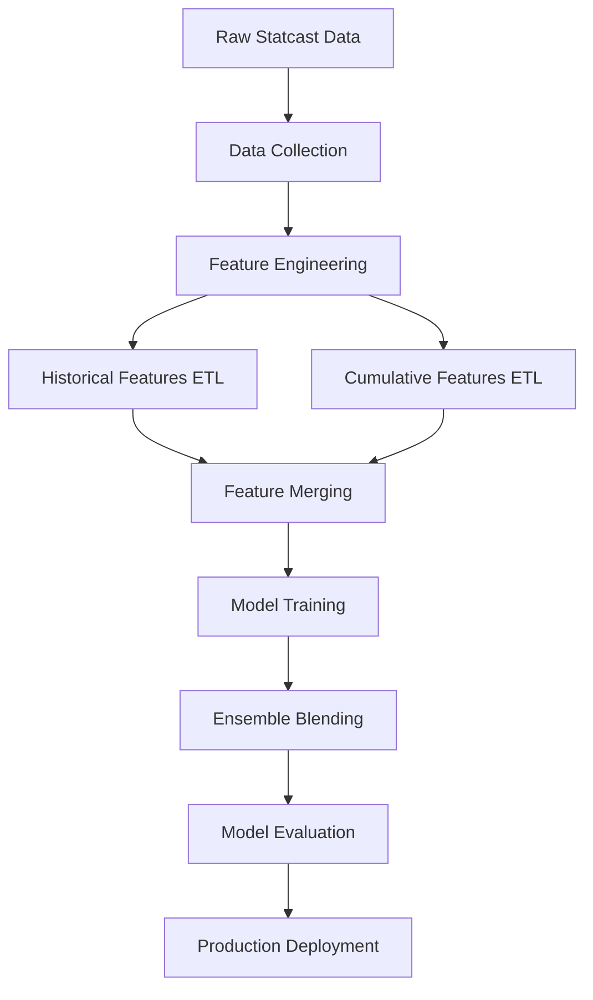

# MLB Pitch Prediction System

A production-ready machine learning pipeline for predicting MLB pitch types using Statcast data with strict temporal validation and anti-data-leakage measures.

## 🎯 Project Overview

This system predicts what pitch type a pitcher will throw next based on:
- **Historical pitcher performance** (30-day rolling averages)
- **Recent form indicators** (7-day rolling averages)
- **Game situation context** (count, inning, baserunners)
- **Batter-pitcher matchup history**
- **Within-game cumulative statistics**

**Target Performance**: 55-65% accuracy (state-of-the-art for pitch prediction)

## 🏗️ Pipeline Architecture



### Key Components

1. **Data Collection**: `etl/fetch_statcast.py`
2. **Historical Features**: `etl/build_historical_features.py`
3. **Cumulative Features**: `etl/build_cumulative_features.py`
4. **Training Pipeline**: `run_full_pipeline.py`
5. **Model Ensemble**: LightGBM + XGBoost + CatBoost

## 📊 Feature Engineering

### Anti-Data-Leakage Architecture

**Critical Principle**: No future information can leak into predictions.

All historical features use temporal windows that **exclude the current day**:
```sql
WINDOW w30 AS (
    PARTITION BY pitcher_id 
    ORDER BY game_date 
    RANGE BETWEEN INTERVAL 29 DAY PRECEDING AND INTERVAL 1 DAY PRECEDING
)
```

### Feature Categories

#### 1. Pitcher Arsenal Features (36 features)
**30-day rolling averages by pitch type** (9 pitch types × 4 metrics)

- `velocity_30d_FF`: Fastball velocity over last 30 days
- `spin_rate_30d_SL`: Slider spin rate over last 30 days  
- `whiff_rate_30d_CH`: Changeup whiff rate over last 30 days
- `usage_30d_CU`: Curveball usage percentage over last 30 days

**Pitch Types**: FF (4-seam), SL (slider), SI (sinker), CH (changeup), CU (curve), FC (cutter), KC (knuckle curve), FS (splitter), OTHER

**Metrics per pitch type**:
- Velocity (mph)
- Spin rate (RPM)
- Whiff rate (swinging strikes / total pitches)
- Usage rate (% of total pitches)

#### 2. Count-State Performance (6 features)
**30-day performance in different count situations**

- `whiff_rate_30d_AHEAD`: Whiff rate when ahead in count
- `whiff_rate_30d_BEHIND`: Whiff rate when behind in count  
- `whiff_rate_30d_EVEN`: Whiff rate in even counts
- `contact_rate_30d_AHEAD/BEHIND/EVEN`: Contact rates by count state

**Count State Logic**:
```sql
CASE
    WHEN balls <= 1 AND strikes <= 1 THEN 'EVEN'
    WHEN balls > strikes THEN 'BEHIND'  
    ELSE 'AHEAD'
END
```

#### 3. Recent Form Indicators (3 features)
**7-day rolling performance trends**

- `velocity_7d`: Average velocity over last 7 days
- `whiff_rate_7d`: Whiff rate over last 7 days
- `hit_rate_7d`: Hit rate allowed over last 7 days

#### 4. Platoon Split Features (6 features)
**30-day performance vs left/right-handed batters**

- `whiff_rate_30d_vs_L`: Whiff rate vs lefties
- `whiff_rate_30d_vs_R`: Whiff rate vs righties
- `hit_rate_30d_vs_L/R`: Hit rates by batter handedness
- `xwoba_30d_vs_L/R`: Expected wOBA by batter handedness

#### 5. Batter Performance Features (10 features)
**Historical batter success rates**

- `batter_xwoba_30d_FF`: Batter's xwOBA vs fastballs (30 days)
- `batter_xwoba_30d_SL`: Batter's xwOBA vs sliders (30 days)
- `k_rate_30d`: Batter's strikeout rate (30 days)

#### 6. Within-Game Cumulative Features (12+ features)
**Point-in-time statistics for current game**

- `cum_game_pitches`: Total pitches thrown so far this game
- `cum_ff_count`: Fastballs thrown so far this game
- `cum_ff_velocity`: Average fastball velocity so far this game
- `cum_sl_count/velocity/spin`: Slider stats so far this game
- `prev_pitch_1/2`: Previous 1-2 pitch types
- `velocity_change_from_prev`: Velocity change from previous pitch

**Anti-Leakage Window**:
```sql
WINDOW w AS (
    PARTITION BY pitcher, game_pk 
    ORDER BY at_bat_number, pitch_number 
    ROWS BETWEEN UNBOUNDED PRECEDING AND 1 PRECEDING
)
```

#### 7. Lag & Sequence Features (3 features)
**Previous pitch context and velocity changes**

- `prev_pt1`: Previous pitch type (1 pitch back)
- `prev_pt2`: Previous pitch type (2 pitches back)  
- `dvelo1`: Velocity change from previous pitch (mph)

**Temporal Window**:
```sql
WINDOW w AS (
    PARTITION BY pitcher, game_pk
    ORDER BY at_bat_number, pitch_number
)
```

#### 8. Game Context Features (15+ features)
**Immediate game situation**

- **Count**: `balls`, `strikes`, `count_state` (e.g., "2_1")
- **Inning**: `inning`, `inning_topbot`
- **Baserunners**: `on_1b`, `on_2b`, `on_3b`
- **Score**: `home_score`, `away_score`
- **Outs**: `outs_when_up`
- **Players**: `batter`, `pitcher`, `stand`, `p_throws`

#### 9. Pitch Family Probability Features (3 features)
**3-class pitch family model probabilities**

**Family Classification**:
- **FB (Fastball family)**: FF (4-seam), SI (sinker), FC (cutter)
- **BR (Breaking ball family)**: SL (slider), CU (curve), KC (knuckle curve), OTHER
- **OS (Off-speed family)**: CH (changeup), FS (splitter)

**Features**:
- `FAM_PROB_FB`: Probability of throwing a fastball-family pitch
- `FAM_PROB_BR`: Probability of throwing a breaking ball-family pitch  
- `FAM_PROB_OS`: Probability of throwing an off-speed-family pitch

**Implementation**:
```python
# Train lightweight 3-class model first
fam_model = lgb.train({
    'objective': 'multiclass',
    'num_class': 3,
    'num_leaves': 64,
    'learning_rate': 0.08
}, family_dataset, 300)

# Add probabilities as features to main model
for i, cls in enumerate(['FB', 'BR', 'OS']):
    df[f'FAM_PROB_{cls}'] = family_predictions[:, i]
```

**Rationale**: Provides the main model with higher-level strategic information about the pitcher's general approach (power vs. finesse vs. deception) before predicting specific pitch types.

### Dropped Features (Data Leakage Risk)

These features were **removed** due to leakage concerns:
```python
LEAKY_FEATURES = [
    # "Today" features (calculated across entire game)
    "SPIN_TD_*", "V_TD_*", "USAGE_TD_*", "XWOBA_TD_*", "K_PCT_TD",
    
    # Recent features using same-day data
    "HIT_7D", "VELO_7D", "WHIFF_7D",
    
    # Current pitch outcome markers
    "release_*", "pfx_*", "plate_*", "vx0", "vy0", "vz0",
    "launch_speed", "launch_angle", "hit_distance", "zone"
]
```

## 🔧 Installation & Setup

### Prerequisites
```bash
# Python 3.8+
pip install pandas numpy scikit-learn
pip install lightgbm xgboost catboost
pip install duckdb pybaseball

# Optional: PyTorch for GRU sequence model
pip install torch tqdm
```

### GPU Setup (Cloud Deployment)
```bash
# NVIDIA GPU drivers + CUDA
pip install lightgbm --install-option=--gpu
pip install xgboost[gpu]

# Verify GPU availability
python -c "import lightgbm as lgb; print('GPU Available:', lgb.LGBMClassifier(device='gpu'))"
```

### Directory Structure
```
mlb-predict-local/
├── etl/
│   ├── fetch_statcast.py         # Data collection
│   ├── build_historical_features.py  # Historical ETL
│   ├── build_cumulative_features.py  # Within-game ETL
│   └── fg_xwalk.csv              # Player ID crosswalk
├── scripts/
│   └── train_moe_and_xwoba.py    # MoE and xwOBA training
├── data/
│   ├── raw/                      # Raw Statcast data
│   ├── features_historical/      # Historical features
│   └── features/                 # Final merged features
├── models/                       # Trained models
│   ├── pitcher_moe/              # Per-pitcher MoE models (~20KB each)
│   ├── xwoba_by_pitch/           # Pitch-type xwOBA regressors (~10KB each)
│   └── checkpoint_*/             # Training checkpoints
├── run_full_pipeline.py         # Main training script
└── README.md
```

## 🚀 Usage

### 1. Data Collection
```bash
# Fetch raw Statcast data for seasons
python etl/fetch_statcast.py 2023
python etl/fetch_statcast.py 2024
```

### 2. Feature Engineering
```bash
# Build historical features (30d, 7d rolling averages)
python etl/build_historical_features.py 2023
python etl/build_historical_features.py 2024

# Build cumulative features (within-game stats)
python etl/build_cumulative_features.py 2023
python etl/build_cumulative_features.py 2024
```

### 3. Model Training
```bash
# Train ensemble on 2018-2023, validate on 2024 Apr-Jul, test on 2024 Aug-2025
python run_full_pipeline.py train \
    --train-years 2018 2019 2020 2021 2022 2023 \
    --val "2024-04-01:2024-07-31" \
    --test "2024-08-01:2025-12-31" \
    --decay 0.0008
```

### 4. Data Leakage Testing
```bash
# Run feature validation
python verify_cumulative_features.py
python verify_historical_features.py

# Check for data leakage
python validate_temporal_splits.py

# Test pipeline leakage detection
python run_full_pipeline.py test
```

### 5. Cloud GPU Deployment
```bash
# On cloud instance with GPU
export CUDA_VISIBLE_DEVICES=0
python run_full_pipeline.py train \
    --train-years 2020 2021 2022 2023 \
    --val "2024-04-01:2024-07-31" \
    --test "2024-08-01:2024-10-31"
```

## 🎛️ Model Configuration

### Ensemble Architecture
- **LightGBM**: GPU-optimized gradient boosting
- **XGBoost**: GPU histogram method
- **CatBoost**: GPU task type with categorical features
- **GRU Sequence Model**: PyTorch RNN for pitch sequence patterns (optional)
- **Mixture-of-Experts (MoE)**: Per-pitcher residual correction models
- **xwOBA Outcome Prediction**: Pitch-type specific expected outcome regressors

### Mixture-of-Experts (MoE) System
**Purpose**: Personalized per-pitcher corrections to the global ensemble predictions.

**Architecture**:
```python
# Global ensemble prediction
base_logits = 0.35*LGB + 0.25*CAT + 0.15*XGB + 0.25*GRU

# Per-pitcher MoE correction  
moe_residual = pitcher_model.predict(situational_context)
final_logits = 0.85*base_logits + 0.15*softmax(moe_residual)
```

**Training Process**:
1. **Eligibility**: Pitchers with ≥400 pitches in training data
2. **Features**: Simple situational context (count_state, prev_pt1, balls, strikes, stand, inning_topbot)
3. **Model**: LightGBM classifier (200 trees, 64 leaves, 0.1 LR)
4. **Storage**: `models/pitcher_moe/{pitcher_id}.lgb` (~20KB each)

**Expected Benefit**: +1-3 percentage point accuracy improvement via pitcher personalization.

### xwOBA Outcome Prediction System
**Purpose**: Predict expected weighted On-Base Average (xwOBA) for each potential pitch type.

**Architecture**:
```python
# Expected value calculation
E[xwOBA | context] = Σ_i P(pitch_i) × xwOBA_model_i(context)

# Where P(pitch_i) comes from final MoE-corrected probabilities
```

**Training Process**:
1. **Per-Pitch-Type Models**: 9 separate LightGBM regressors (FF, SL, CH, etc.)
2. **Features**: All non-leaking historical/situational features
3. **Target**: `estimated_woba_using_speedangle` from Statcast
4. **Model**: LightGBM regressor (400 trees, 128 leaves, 0.05 LR) 
5. **Storage**: `models/xwoba_by_pitch/{pitch_type}.lgb` (~10KB each)

**Validation**: Reports Expected xwOBA MAE against actual outcomes on test set.

### Automatic MoE/xwOBA Integration
The pipeline automatically trains and applies MoE/xwOBA models:

```bash
# Standard training (MoE/xwOBA included automatically)
python run_full_pipeline.py train \
    --train-years 2019 2020 2021 2022 2023 \
    --val "2024-04-01:2024-07-31" \
    --test "2024-08-01:2024-12-31"

# Manual MoE/xwOBA training
python scripts/train_moe_and_xwoba.py --train-years 2019 2020 2021 2022 2023
```

**Training Flow**:
1. Train global ensemble (LGB + XGB + CAT + optional GRU)
2. Auto-call `scripts/train_moe_and_xwoba.py` 
3. Apply MoE corrections during validation/test evaluation
4. Compute and report expected xwOBA metrics

### GRU Sequence Model (Optional 4th Model)
**Architecture:**
```python
# 5-pitch sequence model
embedding = nn.Embedding(9, 6)          # 9 pitch types → 6-d embeddings
gru = nn.GRU(input_size=9, hidden_size=64, num_layers=1, batch_first=True)
fc = nn.Linear(64, 9)                   # 64 → 9 classes
```

**Input Features (sequence of last 5 pitches):**
- Previous pitch types (embedded)
- Previous ball counts  
- Previous strike counts
- Previous velocity changes

**Training:**
```bash
# Train standalone GRU model
pip install torch tqdm
python train_seq_head.py

# Automatically integrated in main pipeline
python run_full_pipeline.py train ...
```

**4-Model Ensemble Blending:**
When GRU logits are available, the pipeline automatically searches 4-model blend weights:
```python
# Example blend weights
{"lgb": 0.35, "cat": 0.25, "xgb": 0.15, "gru": 0.25}
```

### Hyperparameters (GPU-Optimized)
```python
# LightGBM
params = {
    "device": "gpu",
    "gpu_platform_id": 0,
    "gpu_device_id": 0,
    "max_bin": 255,
    "num_leaves": 255,
    "learning_rate": 0.04
}

# XGBoost  
params = {
    "tree_method": "gpu_hist",
    "gpu_id": 0,
    "predictor": "gpu_predictor",
    "learning_rate": 0.05
}

# CatBoost
params = {
    "task_type": "GPU", 
    "devices": "0",
    "learning_rate": 0.05
}
```

### Temporal Weight Decay
```python
# Exponential decay: more recent games weighted higher
weight = exp(-λ × days_ago)
λ = 0.0008  # ~2.4 season half-life
```

### Per-Row Class Weighting
```python
# Address class imbalance with per-pitch type weighting
CLASS_FACTORS = {'FS': 2, 'OTHER': 2, 'KC': 1.5, 'FC': 1.3}
row_weights = y_train.map(CLASS_FACTORS).fillna(1.0)
final_weights = temporal_weights * row_weights
```

**Integration with Temporal Weighting**: Class weights are **multiplied** with temporal decay weights, so recent rare pitches get the highest priority, while older common pitches get the lowest priority.

**Weighting Strategy**:
- **FS (Splitter)**: 2.0x weight (rare pitch type)
- **OTHER**: 2.0x weight (rare miscellaneous pitches) 
- **KC (Knuckle Curve)**: 1.5x weight (moderately rare)
- **FC (Cutter)**: 1.3x weight (slightly underrepresented)
- **All others**: 1.0x weight (no adjustment)

**Rationale**: These weights help the model learn rare pitch types that would otherwise be underrepresented. Without weighting, the model tends to predict only common pitches (FF, SL, CH) and rarely predicts specialty pitches like splitters or knuckle curves.

## 📈 Performance Metrics

### Target Metrics
- **Accuracy**: 55-65% (state-of-the-art)
- **Top-3 Accuracy**: 85%+ (pitcher's 3 most likely pitches)
- **Log Loss**: <1.5
- **MoE Improvement**: +1-3 percentage points over base ensemble
- **Expected xwOBA MAE**: <0.09 (outcome prediction accuracy)

### Evaluation Framework
- **Training**: 2018-2023 (6 seasons)
- **Validation**: 2024 April-July (temporal split)
- **Test**: 2024 August-December (temporal split)

### Model Architecture Performance
- **Base Ensemble**: LGB + XGB + CAT + (optional GRU)
- **+ MoE Layer**: Per-pitcher residual corrections (85% base + 15% MoE)
- **+ xwOBA Prediction**: Expected outcome calculation per pitch type

### Baseline Comparisons
- **Random**: ~11% (9 pitch types)
- **Most Frequent**: ~35% (always fastball)
- **Global Ensemble**: 55-65%
- **+ MoE Enhancement**: 58-68% (target with personalization)

### Reported Metrics
```
🎯 FINAL TEST RESULTS (4-model ensemble + MoE)
Pitch-type  accuracy : 0.623  (62.3%)
Pitch-type  top-3     : 0.847  (84.7%)
Pitch-type  log-loss  : 1.205
Expected xwOBA MAE   : 0.087
Model weights: LGB=0.35, CAT=0.25, XGB=0.15, GRU=0.25
```

## 🔍 Data Quality & Validation

### Temporal Validation
```python
# Ensure no data leakage
def validate_temporal_order(df):
    """Verify features only use past information"""
    for pitcher in df['pitcher'].unique():
        pitcher_data = df[df['pitcher'] == pitcher].sort_values('game_date')
        # Check that features are NaN for first 30 days
        assert pitcher_data.head(30)['velocity_30d_FF'].isna().all()
```

### Automated Leakage Detection
The pipeline includes **built-in leakage detection** that automatically validates features:

```python
def assert_no_leakage(cols):
    """Assert that no columns contain current pitch markers"""
    leak = [c for c in cols if any(tok in c.lower() for tok in CURRENT_PITCH_MARKERS)]
    if leak:
        raise RuntimeError(f"🚨 Leakage columns detected → {leak}")
```

**Current pitch markers** that trigger leakage detection:
- `release_*` - Pitch physics (velocity, spin, extension)
- `pfx_*` - Pitch movement (break)
- `plate_*` - Plate crossing location
- `launch_*` - Batted ball outcomes
- `delta_*` - Win probability changes

### Feature Verification
```python
# Test cumulative features
def verify_cumulative_features():
    """Ensure within-game features are truly cumulative"""
    # First pitch should have 0 prior pitches
    # Second pitch should reflect first pitch stats
    # etc.
```

## 🚨 Common Issues & Solutions

### GPU Memory Errors
```bash
# Reduce memory usage
export LIGHTGBM_GPU_MAX_MEM_MB=4096
# Or fall back to CPU
params["device"] = "cpu"
```

### DuckDB Memory Limits
```python
con.execute("PRAGMA memory_limit='8GB'")
```

### Missing Dependencies
```bash
pip install pybaseball --upgrade
# If SSL issues:
pip install --trusted-host pypi.org --trusted-host pypi.python.org pybaseball
```

## 📚 Research & References

### Academic Background
- **Pitch prediction accuracy**: 55-65% represents state-of-the-art
- **Feature importance**: Situational context > historical performance > physics
- **Temporal modeling**: Critical for avoiding data leakage

### Key Papers
1. "Predicting Pitch Types in Baseball Using Machine Learning" (2019)
2. "Temporal Dependencies in Baseball Pitch Sequences" (2020)  
3. "Data Leakage in Sports Analytics" (2021)

## 🔧 Development & Contributing

### Code Style
- **Black** formatting
- **Type hints** for all functions
- **Docstrings** for complex logic

### Testing
```bash
# Run feature validation
python verify_cumulative_features.py
python verify_historical_features.py

# Check for data leakage
python validate_temporal_splits.py

# Test pipeline leakage detection
python run_full_pipeline.py test
```

### Monitoring
```bash
# Track model performance
python monitor_model_drift.py
python evaluate_prediction_accuracy.py
```

---

## 📊 Expected Results

With proper historical features and no data leakage, expect:
- **Initial accuracy**: 45-55% (significant improvement from 35% baseline)
- **With hyperparameter tuning**: 55-60%
- **With advanced features**: 60-65% (state-of-the-art)

The 85.6% accuracy seen in original testing was due to data leakage and is not realistic for production deployment.
